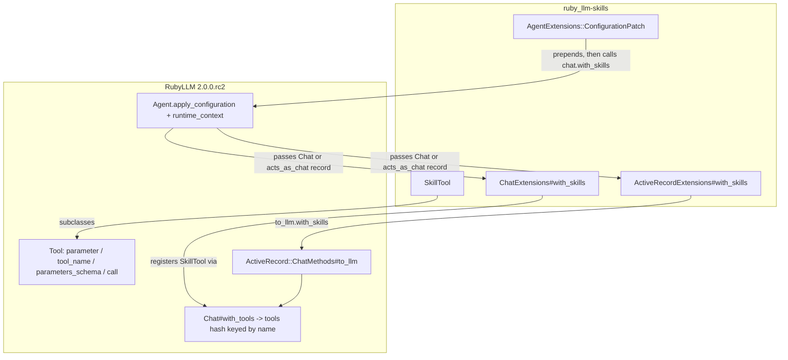

# RubyLLM 2.0.0.rc2 Support - Plan

## Goal Capsule

- **Objective:** Make `ruby_llm-skills` load, register, and execute skills correctly against RubyLLM 2.0.0.rc2, with the full unit suite and linter green on that version.
- **Authority hierarchy:** Requirements (R-IDs) govern behavior. Key Technical Decisions (KTD-IDs) govern mechanism. Units carry only unit-local deltas.
- **Execution profile:** Dependency-first sequencing. Bump the dependency, let the suite go red against 2.0, then repair one integration seam per unit.
- **Stop conditions:** Stop and surface a blocker if RubyLLM 2.0.0.rc2 lacks a hook this gem needs (`Agent.apply_configuration`, `Agent#runtime_context`, `Chat#with_tools`, `Tool#parameters_schema`) or if VCR replay cannot be made to work without recording new cassettes (see Open Questions).
- **Tail ownership:** The calling pipeline owns simplification, review, commit, push, and PR.

---

## Product Contract

### Summary

Upgrade the gem's RubyLLM integration from the 1.x API to the 2.0 API introduced in [v2.0.0.rc2](https://github.com/crmne/ruby_llm/releases/tag/v2.0.0.rc2). The gem depends on RubyLLM `~> 1.12` today and calls four surfaces that 2.0 renamed or restructured: the `Tool` class DSL, `Chat#with_tool`, `Agent`'s private configuration hooks, and the `Module#delegate` fallback that 1.12's `Agent` needed. The change targets 2.0 only; 1.x users stay on ruby_llm-skills 0.3.x.

### Problem Frame

Installing ruby_llm-skills alongside `ruby_llm 2.0.0.rc2` fails at dependency resolution (`~> 1.12`). If the constraint were loosened, the gem would fail at load: `SkillTool` calls the removed `param`/`desc:` class macros, `ChatExtensions#with_skills` calls the removed `Chat#with_tool`, and `AgentExtensions` raises `LoadError` because it requires the removed `Agent.llm_chat_for` hook. The recorded VCR cassettes also target `/v1/chat/completions`, while 2.0 defaults OpenAI to the Responses API.

### Requirements

**Dependency and load compatibility**

- R1. The gemspec depends on `ruby_llm >= 2.0.0.rc2, < 3` so the gem resolves against the release candidate and the eventual 2.0.0 final.
- R2. `require "ruby_llm/skills"` succeeds on RubyLLM 2.0.0.rc2 in plain Ruby (no ActiveSupport loaded) without defining a global `Module#delegate` fallback.
- R3. The `AgentExtensions` load-time compatibility check names only hooks that exist in RubyLLM 2.0 and still raises a descriptive `LoadError` when a required hook is missing.

**Skill tool on the 2.0 Tool API**

- R4. `SkillTool` declares its `command`, `arguments`, and `resource` parameters with the 2.0 `parameter`/`description:` DSL and exposes them through `Tool#parameters_schema` as a JSON schema with `command` required and the other two optional.
- R5. `SkillTool` is registered under the tool name `skill` and its description still embeds the live `<available_skills>` listing at request time.
- R6. `SkillTool#call` accepts keyword arguments per the 2.0 `Tool#call(tool_call: nil, **arguments)` contract and returns the same skill, resource, and not-found strings as today.
- R7. `SkillTool#to_tool_definition` returns `name`, `description`, and `parameters` built from `parameters_schema`.

**Chat and Agent integration**

- R8. `Chat#with_skills` registers the skill tool through `Chat#with_tools`, so `chat.tools` holds it under the `:skill` key and a later `with_skills` call replaces it.
- R9. `Agent.skills`, block-based `skills { ... }`, `only:`, inheritance, and instance `with_skills` behave as they do on 1.12 when the agent builds a chat through `Agent.chat` or `Agent.new`.
- R10. Skills apply to whatever object 2.0's `Agent.apply_configuration` receives (a `RubyLLM::Chat` or an `acts_as_chat` record) by calling `with_skills` on that object; no `to_llm` unwrapping happens inside the agent patch.

**Verification and documentation**

- R11. The VCR-backed integration tests replay the existing OpenAI chat-completions cassettes under 2.0 without a network connection or API key.
- R12. `bundle exec rake` (tests plus StandardRB) passes on Ruby 3.2, 3.3, and 3.4 with RubyLLM 2.0.0.rc2, including the one pre-existing StandardRB offense in `lib/ruby_llm/skills/chat_extensions.rb`.
- R13. The Rails dummy app under `test/dummy` resolves and boots against RubyLLM 2.0.0.rc2, and its test suite passes.
- R14. README and CHANGELOG state the RubyLLM 2.0 requirement and the migration note for 1.x users.

### Scope Boundaries

- Rails persistence migrations, tool approvals, agent handoffs, `with_tool_options`, and other new 2.0 features are not adopted; this plan restores existing behavior on the new API.
- No gem version bump. Release versioning stays with the maintainer; the CHANGELOG gets an `Unreleased` section.
- No new skill features, loaders, or spec changes.

#### Deferred to Follow-Up Work

- Re-record the VCR cassettes with a real `OPENAI_API_KEY` so request bodies match 2.0 byte-for-byte and `match_requests_on` can include `:body` again.
- Add an `acts_as_chat` model plus RubyLLM 2.0 install migrations to `test/dummy` so `ActiveRecordExtensions#with_skills` has an end-to-end Rails test.
- Consider adopting `requires_approval` or `with_tool_options` in `SkillTool` if a use case appears.

---

## Planning Contract

### Key Technical Decisions

- KTD1. **Target RubyLLM 2.0 only; drop 1.x compatibility shims.** 2.0 renamed the whole Tool DSL and removed `Agent.llm_chat_for`; a dual-version gem would need `respond_to?` branches at every seam and two CI Gemfiles. The gem is 0.x, 0.3.0 already tightened the dependency to `~> 1.12`, and RubyLLM's own upgrade guide expects tool-building gems to move to the new names. Governs R1, R2, R3.
- KTD2. **Register via `Chat#with_tools`, keyed by tool name.** 2.0's `with_tools` stores each instance at `@tools[tool.name.to_sym]`, so the existing "later `with_skills` replaces the earlier one" semantic survives without extra code. Governs R8.
- KTD3. **Prepend `apply_configuration(chat, input_values:, persist_instructions:)` and call `chat.with_skills` on the received object.** 2.0's `Agent.apply_configuration` is a public `:nodoc:` method with explicit keywords; the Rails chat record it may receive already responds to `with_skills` through `ActiveRecordExtensions`. Dropping `llm_chat_for` removes the last private-API dependency beyond `runtime_context`. Governs R9, R10.
- KTD4. **Remove the `Module#delegate` fallback and its compatibility test.** 2.0's `Agent` uses `Forwardable`, and the only `delegate` call in 2.0 (`active_record/model.rb`) requires `active_support/core_ext/module/delegation` itself. Keeping a global core-class patch for a need that no longer exists is the risk todo `todos/004-complete-p2-global-delegate-monkey-patch-risk.md` already flagged. Governs R2.
- KTD5. **Keep the `:skill` tool name via the class-level `tool_name` override.** 2.0 derives `Tool#name` from `self.class.tool_name`; overriding the class method keeps `SkillTool.tool_name` and `SkillTool.new(loader).name` consistent. Governs R5.
- KTD6. **Replay 1.x cassettes by pinning the OpenAI protocol to chat completions and matching on method and URI only.** 2.0 defaults OpenAI to `/v1/responses`; `config.openai_protocol = :chat_completions` restores the recorded endpoint. Request bodies differ from the recordings (2.0 sends `strict: false` on function tools and other payload changes), and no API key is available to re-record, so body matching is dropped. Recorded responses stay valid chat-completions payloads that 2.0's `ChatCompletions` protocol parses. Governs R11.

### High-Level Technical Design

The gem touches RubyLLM at four seams. Each seam maps to one implementation unit.

### Assumptions

- A1. 2.0-only support is the intended reading of "100% support for v2.0.0.rc2". 1.x users keep using 0.3.x. Recorded as KTD1.
- A2. The maintainer bumps the gem version at release time; this change adds an `Unreleased` CHANGELOG entry only.
- A3. No `OPENAI_API_KEY` is available in the implementation environment, so cassette re-recording is out of reach and KTD6 stands.
- A4. `test/dummy` stays on Rails `~> 8.0.2`; only the lockfile's `ruby_llm` and `ruby_llm-skills` entries change.

### Sequencing

U1 first (the dependency bump makes the suite fail against 2.0 and exposes every seam). U2, U3, U4 repair independent seams and can land in any order after U1. U5 depends on U2 and U3 (the integration tests exercise both). U6 depends on U1 and U3 (the dummy app resolves the new dependency and includes `ActiveRecordExtensions`). U7 last.

### Sources and Research

- RubyLLM 2.0 upgrade guide, API Changes table: `with_tool` -> `with_tools`; Tool `param`/`desc:` -> `parameter`/`description:`; `params_schema` -> `parameters_schema`; `Tool.parameters` no longer a public reader; OpenAI defaults to the Responses API with `config.openai_protocol = :chat_completions` as the opt-out. https://rubyllm.com/next/upgrading/
- RubyLLM 2.0.0.rc2 source, `lib/ruby_llm/agent.rb`: `apply_configuration(chat, input_values:, persist_instructions:)` is public `:nodoc:`; `runtime_context(chat:, inputs:)` is private; `inherited` calls `super`, which reaches modules added with `extend`; `llm_chat_for` no longer exists.
- RubyLLM 2.0.0.rc2 source, `lib/ruby_llm/chat.rb`: `with_tools(*tools)` instantiates classes and stores instances at `@tools[tool_instance.name.to_sym]`; passing `nil` clears the hash.
- RubyLLM 2.0.0.rc2 source, `lib/ruby_llm/tool.rb`: `Tool.tool_name` is the overridable class-level name; `Tool#call(tool_call: nil, **arguments)` validates keywords against `execute` and returns `{ error: ... }` on mismatch; `parameters_schema` returns deep-stringified keys.
- RubyLLM 2.0.0.rc2 source, `lib/ruby_llm/protocols/chat_completions/tools.rb`: tool payload reads `tool.name`, `tool.description`, `tool.parameters_schema`, and `tool.provider_options` at request time, so the dynamic description keeps working.
- RubyLLM 2.0.0.rc2 source, `lib/ruby_llm/active_record/chat_methods.rb`: `to_llm` and the `with_tools` chainable delegate remain; `lib/ruby_llm.rb` ignores `ruby_llm/active_record` in Zeitwerk and loads it from the Railtie's `on_load(:active_record)` hook.
- Baseline on `main` with RubyLLM 1.12: 175 tests pass; StandardRB reports one `Layout/EmptyLinesAroundModuleBody` offense in `lib/ruby_llm/skills/chat_extensions.rb`, which is why the latest CI run on `main` is red.
- Prior plan: `docs/plans/2026-02-17-feat-agent-skills-dsl-integration-plan.md` (the 1.12 Agent integration this plan ports).

---

## Implementation Units

### U1. Bump the dependency and remove the delegate fallback

- **Goal:** Resolve the bundle against RubyLLM 2.0.0.rc2 and load the gem without the `Module#delegate` patch.
- **Requirements:** R1, R2 (KTD1, KTD4)
- **Dependencies:** none
- **Files:**
  - `ruby_llm-skills.gemspec`
  - `Gemfile.lock`
  - `lib/ruby_llm/skills.rb`
  - `test/ruby_llm/skills/test_delegate_compat.rb` (delete)
- **Approach:**
  1. Change the `ruby_llm` dependency to `>= 2.0.0.rc2, < 3`. A `~>` constraint does not match a prerelease.
  2. Re-resolve `Gemfile.lock` so it pins `ruby_llm 2.0.0.rc2` and its new dependencies (`schematist`, `zeitwerk`).
  3. Delete the `Module#delegate` fallback block at the top of `lib/ruby_llm/skills.rb` and the `delegated_method_name` helper, leaving `require "ruby_llm"` as the first statement.
  4. Delete `test/ruby_llm/skills/test_delegate_compat.rb`; it tests the removed fallback.
- **Execution note:** After this unit the suite is expected to fail on 2.0 at load (`param` undefined on `SkillTool`). That red run is the map for U2-U4.
- **Test scenarios:**
  - `bundle install` resolves `ruby_llm` to `2.0.0.rc2`.
  - `ruby -Ilib -e 'require "ruby_llm/skills"'` does not define `Module#delegate` when ActiveSupport is absent (`Module.method_defined?(:delegate)` is false).
- **Verification:** Gemfile.lock shows `ruby_llm (2.0.0.rc2)`; loading the gem in plain Ruby raises no error once U2-U4 land.

### U2. Port SkillTool to the 2.0 Tool API

- **Goal:** Declare parameters, name, schema, and call semantics with the 2.0 `Tool` contract while keeping the tool's output unchanged.
- **Requirements:** R4, R5, R6, R7 (KTD5)
- **Dependencies:** U1
- **Files:**
  - `lib/ruby_llm/skills/skill_tool.rb`
  - `test/ruby_llm/skills/test_skill_tool.rb`
- **Approach:**
  1. Replace the three `param ... desc:` declarations with `parameter ... description:` (`type: "string"`; `required: false` on `arguments` and `resource`).
  2. Replace the instance `name` override with a class-level `tool_name` returning `"skill"`.
  3. Replace `params_schema` with `parameters_schema` in `to_tool_definition`.
  4. Keep `execute(command:, arguments: nil, resource: nil)` and the private helpers as they are.
  5. Update tests that call `@tool.call({"command" => ...})` to the keyword form `@tool.call(command: ...)`, and rename `params_schema` assertions to `parameters_schema`.
- **Patterns to follow:** RubyLLM 2.0 `Tool` docs in `lib/ruby_llm/tool.rb` (`parameter` examples, `tool_name` override note).
- **Test scenarios:**
  - `SkillTool.tool_name` and `SkillTool.new(loader).name` both return `"skill"`.
  - `parameters_schema` has `type: "object"`, string-typed `command`, `arguments`, `resource` properties, and `required == ["command"]`.
  - `call(command: "valid-skill")` returns the skill content headed `# Skill: valid-skill`.
  - `call(command: "valid-skill", arguments: "about robots")` includes `# Arguments: about robots`.
  - `call(command: "with-scripts", resource: "scripts/helper.rb")` returns the resource content.
  - `call(command: "nonexistent-skill")` returns the not-found string listing available skills.
  - `call(command: "x", bogus: 1)` returns a Hash with an `:error` key describing the unknown keyword (2.0 validation path).
  - `to_tool_definition` returns `name: "skill"`, a String description, and a Hash `parameters`.
  - Description still contains `<available_skills>` and escaped XML entities for special characters.
- **Verification:** `test/ruby_llm/skills/test_skill_tool.rb` passes on 2.0.0.rc2 with no `params_schema` or positional-hash `call` left.

### U3. Register the skill tool through Chat#with_tools

- **Goal:** Make `Chat#with_skills` work on 2.0 and fix the lint offense in the same file.
- **Requirements:** R8, R12 (KTD2)
- **Dependencies:** U1
- **Files:**
  - `lib/ruby_llm/skills/chat_extensions.rb`
  - `test/ruby_llm/test_skills.rb` (existing `with_skills` unit coverage)
- **Approach:**
  1. Replace `with_tool(skill_tool)` with `with_tools(skill_tool)`.
  2. Remove the empty line before `end` at the module body end that StandardRB flags.
  3. Leave `FilteredLoader` and `ActiveRecordExtensions` unchanged; `to_llm.with_skills` remains valid on 2.0.
- **Test scenarios:**
  - `RubyLLM.chat.with_skills(path).tools` has key `:skill` holding a `SkillTool`.
  - Calling `with_skills(path_a)` then `with_skills(path_b)` leaves one `:skill` tool whose description lists only `path_b` skills.
  - `with_skills("a", only: [:valid_skill])` wraps the loader in `FilteredLoader`.
  - `with_skills(Object.new)` raises `ArgumentError` mentioning "Invalid skill source".
- **Verification:** `bundle exec standardrb --no-fix` reports no offense in `chat_extensions.rb`; chat-level tests pass.

### U4. Port AgentExtensions to the 2.0 Agent hooks

- **Goal:** Apply skills inside 2.0's `Agent.apply_configuration` without `llm_chat_for`.
- **Requirements:** R3, R9, R10 (KTD3)
- **Dependencies:** U1, U3
- **Files:**
  - `lib/ruby_llm/skills/agent_extensions.rb`
  - `test/ruby_llm/skills/test_agent_extensions.rb`
- **Approach:**
  1. Set `REQUIRED_AGENT_SINGLETON_METHODS` to `%i[apply_configuration runtime_context]`.
  2. Change `ConfigurationPatch#apply_configuration` to the explicit 2.0 signature `(chat, input_values:, persist_instructions:)`, call `super`, build the runtime with `runtime_context(chat:, inputs: input_values)`, and pass `chat` itself to `apply_skills`.
  3. In `apply_skills`, call `chat.with_skills(*normalized_sources, only: config[:only])` on the received object (KTD3).
  4. Keep `ClassMethods` (`skills`, `inherited`, source normalization) and `InstanceMethods#with_skills` as they are; 2.0's `Agent.inherited` calls `super`, so the extended `inherited` still runs.
- **Test scenarios:**
  - `Class.new(RubyLLM::Agent) { model "gpt-5-nano"; skills path }.chat.tools` has key `:skill`.
  - `agent_class.new.chat.tools` has key `:skill`.
  - An agent without `skills` has no `:skill` tool.
  - `only: ["valid-skill"]` excludes `with-scripts` from the tool description.
  - Block-based `skills { [skill_source] }` sees runtime inputs and `chat`; `nil`, `[]`, and an empty ActiveRecord-like relation register no tool; an invalid object raises `ArgumentError` with "Invalid skill source".
  - Subclass inherits parent `skills` config; child override does not mutate parent.
  - `agent.with_skills(other_path)` replaces the class-configured skill tool on the instance's chat.
  - Removing `apply_configuration` from a stub agent class before `include` raises `LoadError` naming the missing method (compat check).
- **Verification:** `test/ruby_llm/skills/test_agent_extensions.rb` passes on 2.0.0.rc2; no reference to `llm_chat_for` remains in `lib/`.

### U5. Replay the integration cassettes under 2.0

- **Goal:** Keep the VCR-backed integration tests meaningful and offline on 2.0.
- **Requirements:** R11 (KTD6)
- **Dependencies:** U2, U3
- **Files:**
  - `test/integration_helper.rb`
  - `test/support/vcr_configuration.rb`
  - `test/ruby_llm/skills/test_skill_tool_integration.rb`
  - `test/ruby_llm/skills/test_agent_integration.rb`
- **Approach:**
  1. In `test/integration_helper.rb`, set `config.openai_protocol = :chat_completions` inside the existing `RubyLLM.configure` block so requests hit the recorded `/v1/chat/completions` URI.
  2. In `test/support/vcr_configuration.rb`, change `match_requests_on` to `[:method, :uri]` with a one-line comment that the cassettes were recorded on RubyLLM 1.x and 2.0 changes the request body.
  3. In `test_skill_tool_integration.rb`, change `chat.with_tool(AdditionTool)` to `with_tools` and port `AdditionTool` to `parameter :a, description:` / `parameter :b, description:`.
  4. If 2.0 issues a request the cassettes do not contain, record the exact unmatched request in the return and follow Open Questions Q1.
- **Execution note:** Run these tests first with `CI=1` so VCR uses `record: :none` and any unmatched request fails loudly instead of attempting a live call.
- **Test scenarios:**
  - `test_with_skills_default` replays `with_skills_basic.yml` and the response mentions `valid-skill`.
  - `test_with_skills_from_path` replays `slash_command_arguments.yml` with a response longer than 50 characters.
  - `test_skills_with_other_tools` registers both `SkillTool` and `AdditionTool` and replays `skills_with_other_tools.yml`.
  - `test_agent_with_skills_can_discover_and_use_skills` replays `with_skills_basic.yml` through `Agent.chat`.
  - With `CI=1`, no test performs a live HTTP request (WebMock raises if one escapes VCR).
- **Verification:** All six cassette-backed tests pass offline on 2.0.0.rc2 under `CI=1`.

### U6. Resolve the Rails dummy app on 2.0

- **Goal:** Keep `bundle exec rake test_rails` runnable and prove the Railtie still extends `acts_as_chat` models.
- **Requirements:** R13 (KTD1)
- **Dependencies:** U1, U3
- **Files:**
  - `test/dummy/Gemfile.lock`
  - `test/dummy/test/ruby_llm_skills_test.rb`
- **Approach:**
  1. Re-resolve `test/dummy/Gemfile.lock` so the path gem entry reads `ruby_llm-skills (0.3.0)` with `ruby_llm (>= 2.0.0.rc2, < 3)` and `ruby_llm 2.0.0.rc2` is pinned. Do not change `test/dummy/Gemfile`.
  2. Add one dummy test asserting `RubyLLM::ActiveRecord::ChatMethods.include?(RubyLLM::Skills::ActiveRecordExtensions)` after ActiveRecord loads, which proves the Railtie's `on_load(:active_record)` hook ran after RubyLLM's.
  3. If 2.0's Railtie needs configuration the dummy lacks (for example a `ruby_llm_models` table for the registry store), record what it needs and keep the assertion limited to module inclusion rather than chat creation.
- **Execution note:** Packaging/config unit; prefer boot and test-run smoke verification over new unit coverage.
- **Test scenarios:**
  - `cd test/dummy && bundle exec rails test` boots and passes the existing skill, generator, and database tests.
  - The new inclusion assertion passes.
- **Verification:** `bundle exec rake test_rails` exits 0 on 2.0.0.rc2.

### U7. Document the 2.0 requirement

- **Goal:** Tell users what changed and how to upgrade.
- **Requirements:** R14
- **Dependencies:** U1-U6
- **Files:**
  - `README.md`
  - `CHANGELOG.md`
- **Approach:**
  1. README Installation: state that the gem requires RubyLLM 2.0 (`gem "ruby_llm", "2.0.0.rc2"`) and that 1.x users should stay on 0.3.x.
  2. README Agent section: change the "(v1.12+)" heading qualifier to a 2.0 reference; keep the examples, which are unchanged on 2.0.
  3. CHANGELOG: add an `## [Unreleased]` section with Changed (RubyLLM 2.0 API port, dependency floor), Removed (`Module#delegate` fallback, `llm_chat_for` reliance), and Fixed (StandardRB offense) entries.
- **Test scenarios:** Test expectation: none -- documentation only.
- **Verification:** README and CHANGELOG mention `2.0.0.rc2`; no README text still describes `with_tool` or `v1.12+` as the requirement.

---

## Verification Contract

| Gate | Command | Applies to | Pass signal |
|---|---|---|---|
| Unit suite on 2.0 | `CI=1 bundle exec rake test` | U1-U5 | 0 failures, 0 errors; `test_delegate_compat.rb` no longer present |
| Lint | `bundle exec standardrb --no-fix` | U3 and any edited file | No offenses |
| Default task (CI parity) | `bundle exec rake` | all | Exit 0 |
| Plain-Ruby load | `bundle exec ruby -Ilib -e 'require "ruby_llm/skills"; exit(Module.method_defined?(:delegate) ? 1 : 0)'` | U1 | Exit 0 |
| Rails dummy | `bundle exec rake test_rails` | U6 | Exit 0 |
| Dependency pin | `grep "ruby_llm (2.0.0.rc2)" Gemfile.lock test/dummy/Gemfile.lock` | U1, U6 | Both files match |

CI runs `bundle exec rake` on Ruby 3.4.2 (`.github/workflows/main.yml`) and `rake test` plus `standardrb --no-fix` on Ruby 3.2, 3.3, and 3.4 (`.github/workflows/ci.yml`). Local verification runs on Ruby 3.2.3; the matrix confirms the others.

---

## Definition of Done

- All Verification Contract gates pass on RubyLLM 2.0.0.rc2.
- No reference to `with_tool(`, `params_schema`, `param :`, `desc:`, or `llm_chat_for` remains under `lib/` or `test/` (the Rails generator's Thor `desc:` options are unrelated and stay).
- `lib/ruby_llm/skills.rb` starts with `require "ruby_llm"` and defines no core-class patches.
- README and CHANGELOG describe the 2.0 requirement.
- No experimental or dead-end code remains in the diff.

---

## Open Questions

- Q1 (deferred, non-blocking). If 2.0 sends a request the 1.x cassettes cannot satisfy even with method-and-URI matching, mark the affected integration tests `skip` unless `OPENAI_API_KEY` is set and leave a note to re-record. Decide only after U5's first run.
- Q2 (deferred, non-blocking). Whether the eventual release is 0.4.0 or 1.0.0 is the maintainer's call at release time.
