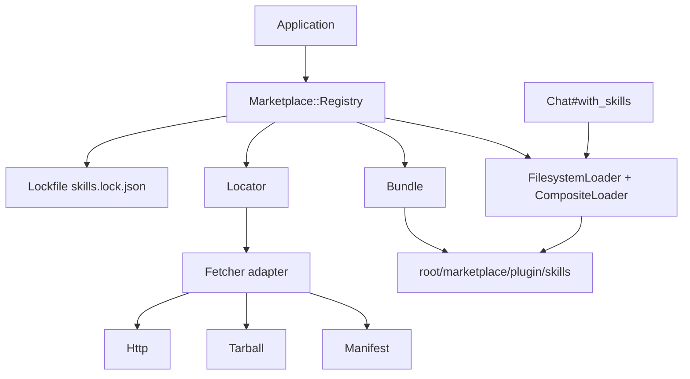

# Marketplace Plugin Support - Plan

## Goal Capsule

- **Objective:** Let a RubyLLM application add a plugin marketplace as a skill source, list its plugins and skills, install all or selected plugins at a pinned version, update and remove them, and reproduce the same install from a lockfile, so BabyAgent can delete its own copy of that code.
- **Authority hierarchy:** Requirements (R-IDs) govern behavior. Key Technical Decisions (KTD-IDs) govern mechanism. Units carry only unit-local deltas. The user's settled decisions (labeled `session-settled`) override family conventions.
- **Execution profile:** Bottom-up in dependency order: transport and archive primitives, then manifest parsing, then fetch adapters, then plugin normalization, then the lockfile-backed registry, then Rake tasks and documentation. Each unit ships with its tests.
- **Stop conditions:** Do not bump the gem version. Do not add runtime gem dependencies. Do not change how `from_directory`, `from_database`, `compose`, `Chat#with_skills`, or `Agent.skills` behave for existing callers. Stop and report if a marketplace behavior BabyAgent depends on cannot be expressed without a Rails or database dependency.
- **Tail ownership:** The calling pipeline owns simplification, review fixes, commit, push, PR creation, and CI repair. It stops at an open PR with green CI and never merges or releases.

---

## Product Contract

### Summary

Add a `RubyLLM::Skills::Marketplace` layer to the gem. It fetches a Claude Code, Codex, or Cursor plugin marketplace over HTTPS (GitHub repository, GitLab project, hosted `marketplace.json`) or from a local directory, parses its plugin catalog, normalizes each plugin into the `skills/` layout the existing loaders read, writes the result under a vendor directory, and records every marketplace and plugin with its resolved commit and version in a JSON lockfile. The installed plugins load through the existing `FilesystemLoader`, so `chat.with_skills` and `Agent.skills` work unchanged.

### Problem Frame

Today the gem loads skills from directories, single-file commands, zip archives, and database records that the application already has on disk. Getting a third-party skill collection onto disk is the application's problem. BabyAgent solved it with roughly 1 500 lines of Rails services (`Marketplaces::{Http,GithubRepo,GitlabRepo,Tarball,Manifest,Locator,Fetcher}` and `Plugins::Bundle`) that fetch a marketplace, parse its manifest in three shapes, download plugin content as tarballs, normalize it into a skills tree, and pin content by commit and tree hash. None of that depends on Rails; all of it belongs in the gem so every RubyLLM application gets it and BabyAgent keeps only its database rows, sync job, and Slack surface.

### Research: what BabyAgent does today

Read at `EveryInc/baby-agent` default branch `9d893e3e`:

- **Sources.** A `Marketplace` row is `(kind, locator, ref)`: `github` (`owner/repo`), `gitlab` (`group/project`), `url` (a hosted `marketplace.json`), `bundled` or `path` (a folder under `Rails.root`). `Marketplaces::Locator.parse` accepts `owner/repo`, `owner/repo@ref`, github.com or gitlab.com URLs with `/tree/<ref>`, `https://…/*.json`, and `./dir`.
- **Discovery.** `Marketplaces::Fetcher` per kind: `head` resolves the ref to a commit sha (GitHub `repos/:repo/commits/:ref`, conditional on ETag), `catalog_files` fetches `.claude-plugin/marketplace.json`, `.agents/plugins/marketplace.json`, `.cursor-plugin/marketplace.json` from raw content, `source_tree` downloads one plugin's files from the codeload tarball at that sha (subdir for relative sources, another repository's tarball for `github` entries, a `.tar.gz` for `archive` entries). Nothing runs `git`.
- **Manifest.** `Marketplaces::Manifest.discover` parses the first file found into `Catalog{name, owner, description, version, plugin_root, renames, plugins[]}`; each `Entry{name, description, version, strict, source, overrides}` carries a normalized `Source` of kind `relative`, `github`, `gitlab`, `archive`, or `unsupported` with a reason (`npm`, `command`, zip, other hosts).
- **Normalization.** `Plugins::Bundle` turns a plugin root into the tree ruby_llm-skills loads: `skills/<name>/**` (frontmatter `name` must equal the directory, `description` required), `commands/<name>.md` rewritten to `skills/<name>.md` with `name` pinned, `agents/**/*.md` kept, plugin-level references a skill reaches through `../../x` or `${CLAUDE_PLUGIN_ROOT}/x` copied under `<skill>/.plugin/` and rewritten, everything else (hooks, MCP, LSP, `bin/`, workflows) inventoried and dropped. Plugin manifests are found at root `plugin.json` (Agent Plugins schema), `.claude-plugin/plugin.json`, `.codex-plugin/plugin.json`, `.cursor-plugin/plugin.json`.
- **Versions.** `Plugins::Fetch.resolve_version`: plugin manifest `version`, else the marketplace entry's `version`, else the source commit sha, else the archive digest. A release is immutable per `(marketplace, plugin, version)` and identified by the normalized tree's sha256.
- **Pin, update, remove.** The marketplace `ref` pins a branch, tag, or sha; the hourly `Marketplaces::Sync` re-reads the catalog only when the head moved, refetches tracked plugins whose source commit moved, and `Plugins::AutoUpdate` swaps installs. Uninstall deletes the `PluginInstall` row. Content is extracted to `storage/plugins/<tree_sha256>/` and its `skills/` handed to `RubyLLM::Skills.from_directory`.
- **Security.** HTTPS only, allowlisted hosts for the adapters, redirects followed by hand, 64 MiB archive cap, 16 MiB file cap, 2 000 files and 200 skills per plugin, tar entries with `..`, absolute paths, NUL or backslashes refused, symlinks and devices dropped.
- **Stays in BabyAgent.** `Marketplace`, `MarketplaceSubscription`, `PluginRelease`, `PluginInstall` rows, `Marketplaces::Sync`, `Plugins::{Fetch,Installer,Materializer,Collision,AutoUpdate,Inspect}`, builtins and default installs, Slack digests, dashboards, analytics.

Real marketplaces checked: `typesafe-ai/skills` (one relative plugin `./`, skills under `skills/`), `EveryInc/compound-writing` (`./`, `metadata.version` 2.4.1, `commands/`, `agents/`, root `references/` and `defaults/` that skills reach through `../../references/…`), `EveryInc/compound-engineering-plugin` (`./`, `.claude-plugin/plugin.json` version 3.26.3, a large repository where only `skills/`, `commands/`, `agents/` matter).

### Requirements

**Sources and discovery**

- R1. `RubyLLM::Skills.marketplaces(root:, lockfile:)` returns a registry; `root` defaults to `vendor/skills` and `lockfile` to `skills.lock.json`, both relative to the working directory, or to `Rails.root` when Rails is loaded.
- R2. `Registry#add(locator, ref: nil, as: nil)` accepts `owner/repo`, `owner/repo@ref`, a github.com or gitlab.com repository URL with an optional `/tree/<ref>`, an `https://` URL ending in `.json`, or a local directory path, resolves the ref to a commit, fetches the marketplace file, and records the marketplace under its manifest `name` (or `as`).
- R3. Marketplace files are discovered in this order: `.claude-plugin/marketplace.json`, `.agents/plugins/marketplace.json`, `.cursor-plugin/marketplace.json`; a hosted URL is the file itself.
- R4. Each plugin entry resolves to one source: relative path inside the marketplace (`"./x"`, `{source: "local", path}`, `{path}`, honoring `metadata.pluginRoot`), `{source: "github", repo, ref?, sha?}`, `{source: "url"|"git-subdir"}` on github.com or gitlab.com, `{source: "archive", url, sha256?}` for a `.tar.gz`, or unsupported with a reason. Relative sources are unsupported from a hosted URL marketplace.
- R5. `Registry#plugins(name)` lists the catalog entries of an added marketplace offline, each with `name`, `description`, `version`, `supported?`, and the unsupported reason.
- R6. `Registry#list` returns the recorded marketplaces with kind, locator, ref, commit, and installed plugin names.

**Install and normalize**

- R7. `Registry#install(name, only: nil)` fetches every supported plugin of the marketplace (or `only` the named ones), normalizes it, and writes it to `<root>/<marketplace>/<plugin>/`; `Registry#install` with no arguments reproduces every lockfile entry at its recorded commit.
- R8. A normalized plugin tree holds `skills/<name>/**` for directory skills whose frontmatter `name` matches the directory (case-insensitive, `_` equals `-`) and whose `description` is present, `skills/<name>.md` for each `commands/**/*.md` with a description (nested paths joined with `-`, `name` pinned to the file name), and `agents/**/*.md` verbatim. A root `SKILL.md` becomes one skill named after the plugin. Manifest `skills`, `commands`, and `agents` path overrides are honored.
- R9. Plugin-level files a skill reaches through `${CLAUDE_PLUGIN_ROOT}/x`, `${PLUGIN_ROOT}/x`, or `../` relative paths are copied under `<skill>/.plugin/<path>` and the references rewritten; references that resolve to nothing stay as text and are listed as unresolved.
- R10. A plugin with more than 200 skills, more than 2 000 files, a file over 16 MiB, an archive over 64 MiB, a duplicate skill name, or a skill name that fails the Agent Skills pattern is refused with a `Marketplace::InvalidPluginError`.
- R11. Plugin directories are written to a scratch directory and moved into place with one rename; a failed install leaves no partial tree.

**Versions, lockfile, update, remove**

- R12. The lockfile is JSON with `version: 1` and a `marketplaces` map; each marketplace records `kind`, `locator`, `ref`, `commit`, and a `plugins` map; each plugin records `version`, `version_kind` (`manifest`, `entry`, `commit`, `archive`), `commit`, `tree_sha256`, `source`, and `skills`. Keys are sorted so the file diffs cleanly. (session-settled: user-directed — chosen over storing state only on disk: the user asked for a lockfile or equivalent so installs are reproducible.)
- R13. A plugin's version is the plugin manifest `version`, else the entry's `version`, else the source commit sha, else the archive digest.
- R14. A marketplace `ref` of a 40-hex sha or a tag pins the marketplace; a branch or no ref follows the default branch. `Registry#update(name = nil, only: nil)` re-resolves each ref, re-reads the catalog when the head moved, refetches installed plugins whose source commit moved, rewrites the lockfile, and returns what changed. (session-settled: user-directed — chosen over version-only pins: the user asked for commit SHA or tag pins.)
- R15. `Registry#remove(name)` deletes `<root>/<marketplace>/` and the lockfile entry; `Registry#uninstall(name, plugin)` deletes one plugin directory and its lockfile entry.
- R16. `Registry#install` and `Registry#update` are idempotent: a plugin whose recorded `tree_sha256` matches the tree on disk is not rewritten.

**Loading**

- R17. `RubyLLM::Skills.from_marketplaces(root:, lockfile:)` and `Registry#loader` return a loader over every installed plugin's `skills/` directory in lockfile order, built from the existing `FilesystemLoader` and `CompositeLoader`.
- R18. `Chat#with_skills` and `Agent.skills` accept a `Registry` as a source and use its loader; every existing source type keeps working. (session-settled: user-directed — chosen over a marketplace-only entry point: the user required the current per-skill install path to keep working.)

**Transport and safety**

- R19. All network access is HTTPS through one `Marketplace::Http` client built on `Net::HTTP`: at most 3 redirects, an open timeout of 10 s and read timeout of 120 s, a streamed body abandoned when it passes the byte cap, `If-None-Match` support, and adapter hosts allowlisted by name (`api.github.com`, `raw.githubusercontent.com`, `codeload.github.com`, `gitlab.com`); a marketplace author's URL (hosted file, archive) is admitted through a configurable `url_guard` callable that defaults to HTTPS-only.
- R20. `Marketplace.configure` exposes `github_token` (default `ENV["GITHUB_TOKEN"]`, sent to GitHub hosts only), `max_archive_bytes`, `max_file_bytes`, `max_files`, `max_skills`, `user_agent`, and `url_guard`.
- R21. Tar entries with `..`, absolute paths, NUL bytes, or backslashes are refused; symlinks, hardlinks, devices, and FIFOs are dropped, never followed.

**Compatibility and packaging**

- R22. The gem keeps `ruby_llm >= 2.0.0.rc3, < 3` and adds no runtime dependency; `Marketplace` uses `net/http`, `json`, `zlib`, `rubygems/package`, `digest`, `fileutils`, and `tmpdir` from the standard library. (session-settled: user-directed — chosen over supporting RubyLLM 1.x too: the user required RubyLLM 2.x only.)
- R23. `RubyLLM::Skills::VERSION` is not changed. (session-settled: user-directed — chosen over bumping to 0.5.0.pre1 in this PR: Kieran releases.)
- R24. Rake tasks `skills:marketplaces:{add,list,plugins,install,update,remove}` load through the Railtie and through `require "ruby_llm/skills/tasks"` in a plain Rakefile.
- R25. The README gains a "Marketplaces" section and `CHANGELOG.md` an `Unreleased` entry; both describe the API and lockfile.
- R26. Tests use on-disk fixture marketplaces, WebMock stubs for GitHub and hosted URL transport, and one VCR cassette recorded against `typesafe-ai/skills` at commit `65a39f393687675ce170e6094757de20370365b9`.

### Acceptance Examples

- AE1. Covers R2, R7, R12, R13, R17.
  - **Given:** An empty `root` and no lockfile.
  - **When:** `marketplaces.add("typesafe-ai/skills", ref: "65a39f39…")` then `marketplaces.install("typesafe-ai")`.
  - **Then:** `vendor/skills/typesafe-ai/typesafe/skills/typesafe-ai/SKILL.md` exists, the lockfile records commit `65a39f39…`, `version` equal to that sha with `version_kind: "commit"`, and `marketplaces.loader.find("typesafe-ai")` returns the skill.
- AE2. Covers R8, R9.
  - **Given:** A fixture plugin with `skills/draft/SKILL.md` that says `Read ../../references/contract.md`, `commands/help.md`, and `agents/reviewer.md`.
  - **When:** The plugin is installed.
  - **Then:** The tree holds `skills/draft/SKILL.md` rewritten to `.plugin/references/contract.md`, `skills/draft/.plugin/references/contract.md`, `skills/help.md` with `name: help`, and `agents/reviewer.md`.
- AE3. Covers R14, R16.
  - **Given:** A directory marketplace installed at tree T1.
  - **When:** The marketplace folder does not change and `update` runs.
  - **Then:** Nothing is rewritten and the result reports no changes; after the folder's skill body changes, `update` rewrites the plugin and reports it moved.
- AE4. Covers R7 (reproduce), R11.
  - **Given:** A lockfile and an empty `root`.
  - **When:** `marketplaces.install` runs with no arguments.
  - **Then:** Every recorded plugin is fetched at its recorded commit and its tree sha256 matches the lockfile; a fetch that fails leaves no directory for that plugin.
- AE5. Covers R4, R5.
  - **Given:** A marketplace file with `npm` and `github` sourced entries.
  - **When:** `plugins(name)` runs.
  - **Then:** The `npm` entry is listed with `supported?: false` and reason `npm_source`; the `github` entry is supported.
- AE6. Covers R18.
  - **Given:** A registry with one installed plugin.
  - **When:** `chat.with_skills("app/skills", marketplaces)`.
  - **Then:** The skill tool lists both the directory skills and the plugin's skills.

### Scope Boundaries

- No `git` execution; every byte comes over HTTPS or from a local directory.
- No database, Rails model, background job, or Slack surface; BabyAgent keeps those.
- No install of hooks, MCP servers, LSP servers, executables, or workflows; they are dropped from the tree. Component inventory beyond skills and agents stays in BabyAgent.
- No per-plugin version selection other than the marketplace ref; a plugin version maps to a commit only through git history the gem does not have.
- No CLI executable; the gem has none today and the Rake surface is the equivalent.
- No automatic auto-update or scheduling; `update` is an explicit call.
- No DNS pinning or private-address checks inside the gem; the `url_guard` hook lets an application add them.

### Deferred to Follow-Up Work

- A `Registry#outdated` query that reports available moves without applying them.
- A `renames` map honored across `update` (the Claude Code marketplace `renames` field), once a real marketplace uses it.
- Fix the pre-existing `RubyLlm::Skills` constant typo in `lib/ruby_llm/skills/tasks/skills.rake`.

---

## Planning Contract

### Key Technical Decisions

- KTD1. **One namespace, `RubyLLM::Skills::Marketplace`, with a `Registry` facade.** Internals (`Http`, `Tarball`, `Manifest`, `Locator`, `Fetcher`, `Bundle`, `Lockfile`) are classes under the namespace; applications touch `RubyLLM::Skills.marketplaces`, `RubyLLM::Skills.from_marketplaces`, and `Registry`. Implements R1, R6, R17 and mirrors `from_directory`/`compose` naming.
- KTD2. **Key marketplaces by manifest `name`, override with `as:`.** Claude Code and BabyAgent both identify a marketplace by the manifest name; a second marketplace with the same name is refused unless `as:` is given. Implements R2.
- KTD3. **Install to `<root>/<marketplace>/<plugin>/` and keep the raw marketplace file at `<root>/<marketplace>/marketplace.json`.** The lockfile stays small; `plugins(name)` reads the cached file offline; `from_marketplaces` composes one `FilesystemLoader` per `<plugin>/skills`. Implements R5, R7, R17.
- KTD4. **Lockfile carries enough to reinstall without the catalog.** Each plugin records its normalized `source` and `commit`, so `install` with no arguments needs only the lockfile. Implements R7, R12.
- KTD5. **Normalize with reference relocation, as BabyAgent does.** The `SkillTool` reads resources only inside `skill.path`, so a skill's plugin-level references must live under the skill. `Bundle` copies them under `.plugin/` and rewrites the text; this is the behavior BabyAgent verified against compound-writing. Implements R8, R9.
- KTD6. **`Net::HTTP` instead of Faraday.** The gem has no runtime dependency beyond `ruby_llm`; `Net::HTTP` gives streamed bodies and per-connection timeouts without adding one. Implements R19, R22.
- KTD7. **Adapters own the network shape; `Registry` owns state.** `Fetcher::{Github,Gitlab,Url,Directory}` expose `head`, `catalog_files`, `source_tree`, `source_sha`; `Registry` composes them with `Lockfile` and the filesystem. This is the seam BabyAgent will call from its `Marketplaces::Sync` while keeping its rows. Implements R7, R14.
- KTD8. **Directory marketplaces are first-class.** A local folder with a marketplace file is a valid source (BabyAgent's `bundled`/`path` kinds), its head is the tree sha256, and it is the primary fixture mechanism for tests. Implements R2, R26.
- KTD9. **Atomic writes via scratch directory and rename; idempotence via `tree_sha256` on disk.** Before writing, the registry hashes the existing tree with `Tarball.tree_sha256(Tarball.from_directory(dir))` and skips when equal. Implements R11, R16.
- KTD10. **`Registry` is a `with_skills` source through one `when` branch in `to_loader`.** `ChatExtensions#to_loader` and `AgentExtensions` recognize `Marketplace::Registry` and call `#loader`; no change to `SourceDetection` predicates. Implements R18.
- KTD11. **Configuration is a plain struct on the namespace.** `Marketplace.config` / `Marketplace.configure` hold the caps, token, user agent, and `url_guard`; tests reset it in `setup`. Implements R20.

### High-Level Technical Design



Install flow for one plugin:

```text
add(locator, ref)
  Locator.parse -> Source(kind, locator, ref)
  Fetcher.for(source).head -> commit
  Fetcher.catalog_files(commit) -> Manifest.discover -> Catalog
  write root/<name>/marketplace.json, lockfile marketplace entry

install(name, only)
  for each supported Entry
    sha  = fetcher.source_sha(entry.source, head)
    files = fetcher.source_tree(entry.source, head)      # Tarball.read subdir / other repo / archive
    bundle = Bundle.new(files, entry: entry)             # skills, commands, agents, relocation, caps
    skip when lock tree_sha256 == on-disk tree sha256
    write scratch -> rename root/<name>/<plugin>
    lock plugin entry {version, version_kind, commit, tree_sha256, source, skills}
```

### Output Structure

```text
lib/ruby_llm/skills/marketplace.rb
lib/ruby_llm/skills/marketplace/config.rb
lib/ruby_llm/skills/marketplace/http.rb
lib/ruby_llm/skills/marketplace/tarball.rb
lib/ruby_llm/skills/marketplace/manifest.rb
lib/ruby_llm/skills/marketplace/locator.rb
lib/ruby_llm/skills/marketplace/github_repo.rb
lib/ruby_llm/skills/marketplace/gitlab_repo.rb
lib/ruby_llm/skills/marketplace/fetcher.rb
lib/ruby_llm/skills/marketplace/bundle.rb
lib/ruby_llm/skills/marketplace/lockfile.rb
lib/ruby_llm/skills/marketplace/registry.rb
lib/ruby_llm/skills/tasks.rb
lib/ruby_llm/skills/tasks/marketplaces.rake
test/fixtures/marketplaces/basic/.claude-plugin/marketplace.json
test/fixtures/marketplaces/basic/plugins/writing/**
test/fixtures/marketplaces/codex/.agents/plugins/marketplace.json
test/fixtures/marketplaces/cursor/.cursor-plugin/marketplace.json
test/fixtures/vcr_cassettes/marketplace_typesafe_skills.yml
test/ruby_llm/skills/marketplace/test_*.rb
```

### Risks and Dependencies

- GitHub API rate limits apply to unauthenticated `commits/:ref` and `repos/:repo` calls; the default `GITHUB_TOKEN` pickup and the ETag path keep this small. Tests never hit the network except through the recorded cassette.
- The codeload tarball of a large repository (compound-engineering-plugin) is read fully into memory before the subdir filter; the 64 MiB cap bounds it, as in BabyAgent.
- Reference relocation is heuristic text rewriting; it is scoped to `.md` files inside a skill and to paths that exist in the plugin, and unresolved references are reported rather than guessed.
- `rubygems/package` `TarReader` behavior is stable across Ruby 3.2 to 3.4, which the CI matrix covers.

---

## Implementation Units

### U1. Namespace, configuration, HTTP client, tarball

**Goal:** Give the marketplace layer its error classes, configuration, HTTPS transport, and tar.gz reader/writer.

**Requirements:** R19, R20, R21, R22; KTD1, KTD6, KTD11

**Dependencies:** None

**Files:**

- Create `lib/ruby_llm/skills/marketplace.rb` (requires, `Error < Skills::Error`, `FetchError`, `InvalidManifestError`, `InvalidPluginError`, `LockfileError`, `configure`/`config`).
- Create `lib/ruby_llm/skills/marketplace/config.rb`.
- Create `lib/ruby_llm/skills/marketplace/http.rb`.
- Create `lib/ruby_llm/skills/marketplace/tarball.rb`.
- Modify `lib/ruby_llm/skills.rb` to require the namespace.
- Create `test/ruby_llm/skills/marketplace/test_http.rb`, `test/ruby_llm/skills/marketplace/test_tarball.rb`.

**Approach:**

1. `Http.get(url, hosts:, public:, headers:, max_bytes:, etag:)` returns `Response(status, body, headers)` with `success?`, `not_modified?`, `not_found?`, `etag`; follows up to 3 redirects by hand; streams the body with `read_body` and raises `FetchError` past `max_bytes`; refuses non-HTTPS and hosts outside `hosts` unless `public` is true, in which case `config.url_guard.call(uri)` runs per hop.
2. `Tarball.read(bytes, strip_root:, subdir:, caps…)` returns `{ "path" => bytes }` per BabyAgent's rules; `Tarball.write(files)` is its deterministic inverse (mtime 0, sorted); `Tarball.from_directory(dir)` reads regular files only; `Tarball.tree_sha256(files)` hashes sorted paths and content digests.
3. `Config` is a `Struct` with keyword defaults; `Marketplace.reset_config!` for tests.

**Patterns to follow:** BabyAgent `app/services/marketplaces/http.rb` and `tarball.rb` for behavior; gem error hierarchy in `lib/ruby_llm/skills/error.rb`.

**Test scenarios:**

- `Http.get` follows a 302 to an allowlisted host and returns the final body; a fourth redirect raises `FetchError`.
- A response larger than `max_bytes` raises `FetchError` and reads no further chunks.
- An `http://` URL and a non-allowlisted host without `public:` raise `FetchError`; with `public:` the `url_guard` is called with the URI.
- `If-None-Match` is sent when `etag:` is given and a 304 yields `not_modified?`.
- `Tarball.read` strips one root, keeps the subdir, refuses `..` and absolute entries, drops a symlink, raises past `max_files` and `max_file_bytes`.
- `Tarball.write` then `read(strip_root: false)` round-trips and two writes of the same hash are byte-identical.
- `tree_sha256` changes when a file's bytes change and is independent of insertion order.

**Verification:** `bundle exec rake test` green with the new tests; `bundle exec standardrb` clean.

### U2. Manifest parsing and locator

**Goal:** Parse the three marketplace file shapes into a catalog of entries with normalized sources, and parse what a user types into a marketplace source.

**Requirements:** R2, R3, R4, R5; KTD2

**Dependencies:** U1

**Files:**

- Create `lib/ruby_llm/skills/marketplace/manifest.rb` (`PATHS`, `Catalog`, `Entry`, `PluginSource` as `Data`, `discover`, `parse`, `normalize_relative`).
- Create `lib/ruby_llm/skills/marketplace/locator.rb` (`Source = Data.define(:kind, :locator, :ref)`, `parse`).
- Create `test/fixtures/marketplaces/basic/.claude-plugin/marketplace.json`, `test/fixtures/marketplaces/codex/.agents/plugins/marketplace.json`, `test/fixtures/marketplaces/cursor/.cursor-plugin/marketplace.json`.
- Create `test/ruby_llm/skills/marketplace/test_manifest.rb`, `test/ruby_llm/skills/marketplace/test_locator.rb`.

**Approach:**

1. Port BabyAgent's `Manifest` without ActiveSupport: `presence` becomes explicit empty checks, `10.megabytes` a constant.
2. `PluginSource` kinds: `relative`, `github`, `gitlab`, `archive`, `unsupported` (with `reason`); `to_h`/`from_h` for the lockfile.
3. `Locator.parse` returns `Source(kind: "github"|"gitlab"|"url"|"directory", locator:, ref:)`; a directory is any existing directory path or a `./` prefix; `owner/repo@ref` splits on the first `@`.

**Patterns to follow:** BabyAgent `manifest.rb` and `locator.rb`; `Data.define` usage requires Ruby 3.2, which matches `required_ruby_version`.

**Test scenarios:**

- Claude shape parses name, owner, `metadata.pluginRoot`, and relative sources with the root prefixed.
- Codex shape reads `interface.displayName` and `{source: "local", path}`; Cursor shape reads `{path}`.
- `{source: "github", repo, sha}` with a bad sha is unsupported `invalid_sha`; `npm` is unsupported `npm_source`; a `git-subdir` on bitbucket is `unsupported_host`; a zip archive is `zip_archive`.
- Missing `plugins[]`, non-kebab name, duplicate plugin names, and invalid JSON raise `InvalidManifestError`.
- `Locator.parse` handles `owner/repo`, `owner/repo@v1.2.0`, `https://github.com/o/r/tree/main`, `https://gitlab.com/g/sub/p/-/tree/dev`, `https://example.com/m.json`, `./fixtures/marketplaces/basic`, and rejects `http://`, userinfo, and `owner`.

**Verification:** Tests green; every fixture file parses.

### U3. Repository clients and fetch adapters

**Goal:** Resolve heads, fetch marketplace files, and download plugin trees from GitHub, GitLab, a hosted URL, or a directory.

**Requirements:** R2, R3, R4, R14, R19; KTD7, KTD8

**Dependencies:** U1, U2

**Files:**

- Create `lib/ruby_llm/skills/marketplace/github_repo.rb`, `lib/ruby_llm/skills/marketplace/gitlab_repo.rb`.
- Create `lib/ruby_llm/skills/marketplace/fetcher.rb` (`Head`, `Fetched`, `Base`, `Github`, `Gitlab`, `Url`, `Directory`, `Fetcher.for(source)`).
- Create `test/ruby_llm/skills/marketplace/test_github_repo.rb`, `test/ruby_llm/skills/marketplace/test_fetcher.rb`.

**Approach:**

1. `GithubRepo#default_branch`, `#commit(ref, etag:)`, `#file(sha, path)`, `#tarball(sha)`, `#tree_url`; token header on GitHub hosts only.
2. `Fetcher::Base#source_tree(source, head)` dispatches on `source.kind`; one tarball download per `(repo, sha)` is memoized per fetcher instance; `#source_sha` answers "did this plugin move" without a download.
3. `Fetcher::Directory` reads the folder with `Tarball.from_directory`, head is `tree_sha256`, `source_tree` slices the subdir.
4. `Fetcher::Url` fetches the file with `public: true`, head is the body's sha256, relative sources raise `FetchError`.

**Patterns to follow:** BabyAgent `fetcher.rb`, `github_repo.rb`, `gitlab_repo.rb`.

**Test scenarios:**

- `Github#head` with a branch ref calls `commits/:ref`, returns the sha, and reports `unchanged?` when it equals the previous sha; a 304 keeps the previous sha.
- `catalog_files` returns only the manifest paths that exist (404s skipped).
- `source_tree` for a relative source reads the memoized tarball once for two plugins.
- A `github` entry pinned by `sha` fetches that sha's tarball from the other repository.
- An `archive` entry with a matching `sha256` returns files with a single wrapping folder stripped; a mismatch raises.
- `Directory#head` changes when a file changes; `source_tree` for a missing subdir raises.
- `Url#source_tree` for a relative source raises with a clear message.

**Verification:** Tests green with WebMock; no network.

### U4. Plugin bundle normalization

**Goal:** Turn one plugin's files into the normalized skills tree the loaders read, with validation and reference relocation.

**Requirements:** R8, R9, R10, R13; KTD5

**Dependencies:** U1, U2

**Files:**

- Create `lib/ruby_llm/skills/marketplace/bundle.rb`.
- Create `test/fixtures/marketplaces/basic/plugins/writing/**` (skills with a `../../references` reference, `commands/`, `agents/`, `.claude-plugin/plugin.json`, a `hooks/hooks.json` to drop).
- Create `test/fixtures/marketplaces/basic/plugins/broken/**` (frontmatter name mismatch).
- Create `test/ruby_llm/skills/marketplace/test_bundle.rb`.

**Approach:**

1. Port BabyAgent `Plugins::Bundle` minus the component inventory: keep manifest discovery and entry merge, skills, commands, agents, `relocate_references`, caps, and `tree_sha256`. Expose `name`, `manifest`, `manifest_version`, `version` (per R13 with the entry), `version_kind`, `tree`, `skills` (`Data` with `name`, `description`, `kind`, `path`, `frontmatter`), `agents` (paths), `unsupported` (commands without description), `unresolved_references`, `dropped` (paths not kept), `write!(dir)`.
2. Frontmatter parsing reuses `Parser.parse_string` and `Parser.extract_body`; validation reuses `Validator::NAME_PATTERN`, `NAME_MAX_LENGTH`, `DESCRIPTION_MAX_LENGTH`.

**Patterns to follow:** BabyAgent `plugins/bundle.rb`; the gem's `Parser` and `Validator`.

**Test scenarios:**

- Directory skills are kept under `skills/<name>/`; a frontmatter name that differs from the directory raises `InvalidPluginError` naming both.
- `commands/cw-help.md` becomes `skills/cw-help.md` with `name: cw-help`; `commands/a/b.md` becomes `skills/a-b.md`; a command without a description is in `unsupported` and not in the tree.
- `agents/review/x.md` is kept at `agents/review/x.md`.
- `../../references/contract.md` in a skill is rewritten to `.plugin/references/contract.md` and the file is copied; `${CLAUDE_PLUGIN_ROOT}/defaults/` copies the folder; a reference to a missing file stays as-is and is listed.
- `hooks/`, `bin/`, `.mcp.json`, `README.md` are absent from the tree and present in `dropped`.
- Version resolution: manifest version wins over entry version; with neither, `version_kind` is `commit`; a `strict: false` entry with no manifest builds from the entry.
- Duplicate skill names, more than `max_skills` skills, and an invalid skill name raise.

**Verification:** Tests green; `Bundle.new(files).tree_sha256` is stable across runs.

### U5. Lockfile and registry

**Goal:** Provide the public API: add, list, plugins, install, update, remove, uninstall, loader, and reproducible reinstall from the lockfile.

**Requirements:** R1, R2, R5, R6, R7, R11, R12, R14, R15, R16, R17, R18; KTD1, KTD2, KTD3, KTD4, KTD9, KTD10

**Dependencies:** U1 through U4

**Files:**

- Create `lib/ruby_llm/skills/marketplace/lockfile.rb`.
- Create `lib/ruby_llm/skills/marketplace/registry.rb`.
- Modify `lib/ruby_llm/skills.rb` (`marketplaces`, `from_marketplaces`, `Marketplace.root`/`lockfile` defaults).
- Modify `lib/ruby_llm/skills/chat_extensions.rb` and `lib/ruby_llm/skills/agent_extensions.rb` (`Registry` as a source).
- Modify `lib/ruby_llm/skills/railtie.rb` (Rails-root defaults).
- Create `test/ruby_llm/skills/marketplace/test_lockfile.rb`, `test/ruby_llm/skills/marketplace/test_registry.rb`, `test/ruby_llm/skills/marketplace/test_registry_github.rb` (WebMock and the VCR cassette).
- Modify `test/ruby_llm/skills/test_chat_extensions.rb` for the registry source.

**Approach:**

1. `Lockfile.load(path)` returns a `Lockfile` with `marketplaces` hash; `#save` writes pretty JSON with sorted keys and a trailing newline; a missing file is an empty lockfile; an unknown `version` raises `LockfileError`.
2. `Registry.new(root:, lockfile:)`; `add` → `Locator.parse`, `Fetcher.for`, head, catalog, write `marketplace.json`, record; `plugins(name)` parses the cached file; `install(name = nil, only: nil)`; `update(name = nil, only: nil)` returns `Update` results (`added`, `updated`, `unchanged`, `errors` per plugin); `remove`, `uninstall`; `installed` → `Array<InstalledPlugin(marketplace, name, version, commit, path, skills)>`; `loader` composes `FilesystemLoader`s.
3. Write through `Bundle#write!` into `<root>/<marketplace>/.building-<hex>` and `File.rename`; on failure `rm_rf` the scratch.
4. `to_loader` in `ChatExtensions` and the source normalization in `AgentExtensions` accept `Marketplace::Registry` and use `#loader`.

**Patterns to follow:** `FilesystemLoader`/`CompositeLoader` composition; BabyAgent `Plugins::Materializer.extract!` for the scratch-and-rename write; the gem's keyword-argument style.

**Test scenarios:**

- Covers AE1 (through the `typesafe-ai/skills` cassette) and AE4.
- `add` on a directory fixture records kind `directory`, the tree sha as `commit`, writes `marketplace.json`, and a second `add` of the same name raises unless `as:` differs.
- `install(name)` installs every supported plugin and skips unsupported ones with a reported reason; `only:` restricts; an unknown plugin name raises `NotFoundError`.
- Covers AE3: unchanged `update` rewrites nothing (mtime and tree sha unchanged); a changed fixture updates the tree and lockfile and reports the plugin as updated.
- Pinned sha ref: `update` does not move the marketplace commit; branch ref: a new head is recorded (WebMock).
- `remove` deletes the directory and the entry; `uninstall` deletes one plugin and leaves the marketplace.
- `loader.list` includes skills from two plugins in lockfile order; `RubyLLM::Skills.from_marketplaces(root:, lockfile:)` matches `registry.loader`.
- Covers AE6: `chat.with_skills(registry)` and `chat.with_skills("dir", registry)` build a skill tool listing both sources.
- A failing install (bundle raises) leaves no plugin directory and no lockfile entry.

**Verification:** Full suite green; the cassette replays under `CI=1` (`record: :none`).

### U6. Rake tasks, README, CHANGELOG

**Goal:** Expose the registry through Rake and document the feature.

**Requirements:** R23, R24, R25

**Dependencies:** U5

**Files:**

- Create `lib/ruby_llm/skills/tasks/marketplaces.rake`, `lib/ruby_llm/skills/tasks.rb`.
- Modify `lib/ruby_llm/skills/railtie.rb` to load the new rake file.
- Modify `README.md` (a "Marketplaces" section after "Slash Commands"), `CHANGELOG.md` (`## [Unreleased]`).
- Create `test/ruby_llm/skills/marketplace/test_rake_tasks.rb`.

**Approach:**

1. Tasks `skills:marketplaces:add[locator,ref]`, `list`, `plugins[name]`, `install[name,plugins]`, `update[name]`, `remove[name]`; depend on `:environment` only when that task is defined.
2. README shows add, list, install, update, remove, the lockfile shape, loading with `from_marketplaces` and `with_skills`, and the Rake tasks.

**Test scenarios:**

- Loading `ruby_llm/skills/tasks` defines the six tasks; `skills:marketplaces:list` prints the fixture marketplace after `add` and `install` against a tmp root.

**Verification:** `bundle exec rake` (tests and StandardRB) green; README snippets match the public API names.

---

## Verification Contract

| Gate | Applies to | Done signal |
|---|---|---|
| Unit tests | U1-U6 | `bundle exec rake test` passes on Ruby 3.2 locally; no network outside VCR. |
| Style | U1-U6 | `bundle exec standardrb --no-fix` reports no offenses. |
| Cassette replay | U5 | `CI=1 bundle exec rake test` passes with `record: :none`. |
| Existing behavior | U5 | The 185 pre-existing tests still pass unchanged. |
| Version | U6 | `lib/ruby_llm/skills/version.rb` is unchanged in the diff. |
| CI | U1-U6 | GitHub Actions `CI` (Ruby 3.2, 3.3, 3.4) and `Ruby` workflows pass on the PR. |

---

## Definition of Done

- R1 through R26 are implemented or proven by a test or documentation assertion.
- U1 through U6 are complete in dependency order.
- The README and CHANGELOG describe the shipped API; the version constant is unchanged.
- The full suite and StandardRB pass locally and on the PR's CI matrix.
- No abandoned code, generated artifacts, `vendor/bundle`, or scratch files are in the diff.
- The branch is pushed and represented by an open pull request against `main`; the PR is not merged.
